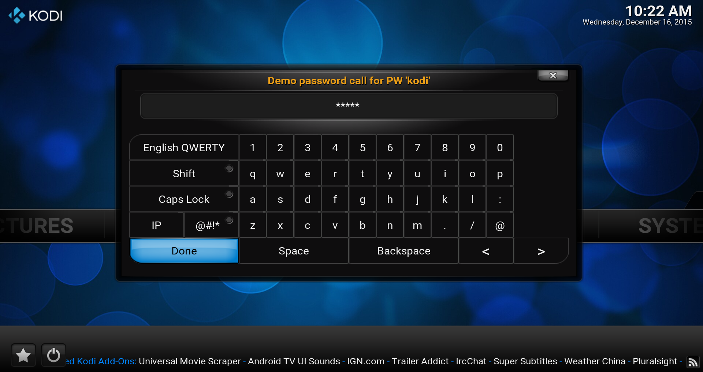

# *<p align="center">Kodi development</p>*
-------------
*<p align="center">
  [](http://kodi.tv/)
  [](http://kodi.tv/)
</p>*
*<p align="center">
  [](../Readme.md#CAddonGUIDialogKeyboard)
</p>*
#### *<p align="center">Binary add-on GUI library, Version Level: 2</p>*
## *<p align="center">Keyboard dialog</p>*
-------------

General
-------------

The functions listed below have to be permitted by the user for the representation of a keyboard around an input.

The class supports several kinds, from an easy text choice up to the passport Word production and their confirmation
for add-on.

It has the header `#include <kodi/gui.api2/GUIDialogKeyboard.h>` be included to enjoy it.

Functions
-------------

1. [bool ShowAndGetInput(std::string& text, const std::string& heading, bool allowEmptyResult, bool hiddenInput, unsigned int autoCloseMs);](#CAddonGUIDialogKeyboard_ShowAndGetInput_1)
* [bool ShowAndGetInput(std::string& text, bool allowEmptyResult, unsigned int autoCloseMs);](#CAddonGUIDialogKeyboard_ShowAndGetInput_2)
* [bool ShowAndGetNewPassword(std::string& newPassword, const std::string& heading, bool allowEmptyResult, unsigned int autoCloseMs);](#CAddonGUIDialogKeyboard_ShowAndGetNewPassword_1)
* [bool ShowAndGetNewPassword(std::string& newPassword, unsigned int autoCloseMs);](#CAddonGUIDialogKeyboard_ShowAndGetNewPassword_2)
* [bool ShowAndVerifyNewPassword(std::string& newPassword, const std::string& heading, bool allowEmptyResult, unsigned int autoCloseMs);](#CAddonGUIDialogKeyboard_ShowAndVerifyNewPassword_1)
* [bool ShowAndVerifyNewPassword(std::string& newPassword, unsigned int autoCloseMs);](#CAddonGUIDialogKeyboard_ShowAndVerifyNewPassword_2)
* [int ShowAndVerifyPassword(std::string& password, const std::string& heading, int iRetries, unsigned int autoCloseMs);](#CAddonGUIDialogKeyboard_ShowAndVerifyPassword)
* [bool ShowAndGetFilter(std::string& text, bool searching, unsigned int autoCloseMs);](#CAddonGUIDialogKeyboard_ShowAndGetFilter)
* [bool SendTextToActiveKeyboard(const std::string& text, bool closeKeyboard);](#CAddonGUIDialogKeyboard_SendTextToActiveKeyboard)
* [bool IsKeyboardActivated();](#CAddonGUIDialogKeyboard_IsKeyboardActivated)

-------------

*<p align="center"></p>*

-------------

*  <a id="CAddonGUIDialogKeyboard_ShowAndGetInput_1"></a>
    **`bool CAddonGUIDialogKeyboard::ShowAndGetInput(std::string& text, const std::string& heading, bool allowEmptyResult, bool hiddenInput = false, unsigned int autoCloseMs = 0);`**
    * Show keyboard with initial value `text` and replace with result string.
      * **`text`:**             Overwritten with user input if return=true.
      * **`heading`:**          Heading to display
      * **`allowEmptyResult`:** Whether a blank string is valid or not.
      * **`hiddenInput`:**      The inserted input is not shown as text.
      * **`autoCloseMs`:**      To close the dialog after a specified time, in milliseconds, default is 0 which 
        keeps the dialog open indefinitely.
      * **return:**
        * `true`  - successful display and input (empty result may return true or false depending on parameter)
        * `false` - unsuccessful display of the keyboard or cancelled editing

      Code example:
      ```cpp
      #include <kodi/gui.api2/GUIDialogKeyboard.h>

      /*
      * The example shows the display of keyboard call dialog at Kodi from the add-on.
      * Below all values are set, however, can last two (hidden input = false and autoCloseMs = 0)
      * to be released if not needed.
      */
      std::string text = "Please change me to them want you want"; /*< It can be leaved empty or a 
                                                                       entry text added */
      bool bRet = CAddonGUIDialogKeyboard::ShowAndGetInput(text,
                                                           "Demonstration text entry",
                                                           true,
                                                           false,
                                                           0);
      fprintf(stderr, "Written keyboard input is : %s and was %s\n",
                        text.c_str(), bRet ? "OK" : "Canceled");
      ```

*  <a id="CAddonGUIDialogKeyboard_ShowAndGetInput_2"></a>
    **`bool CAddonGUIDialogKeyboard::ShowAndGetInput(std::string& text, bool allowEmptyResult, unsigned int autoCloseMs = 0);`**
    * Show keyboard with initial value `text` and replace with result string.
      * **`text`:**             Overwritten with user input if return=true.
      * **`allowEmptyResult`:** Whether a blank string is valid or not.
      * **`autoCloseMs`:**      To close the dialog after a specified time, in milliseconds, default is 0 which keeps the dialog open indefinitely.
      * **return:**
        * `true`   - if successful display and user input entry/re-entry.
        * `false`  - if unsuccessful display, no user input, or canceled editing.

*  <a id="CAddonGUIDialogKeyboard_ShowAndGetNewPassword_1"></a>
    **`bool CAddonGUIDialogKeyboard::ShowAndGetNewPassword(std::string& newPassword, const std::string& heading, bool allowEmptyResult, unsigned int autoCloseMs = 0);`**
    * Shows keyboard and prompts for a password. Differs from `ShowAndVerifyNewPassword()` in that no second verification 
      is necessary.
      * **`newPassword`:**      Overwritten with user input if return=true.
      * **`heading`:**          Heading to display
      * **`allowEmptyResult`:** Whether a blank password is valid or not.
      * **`autoCloseMs`:**      To close the dialog after a specified time, in milliseconds, default is 0 which 
        keeps the dialog open indefinitely.
      * **return:**
        * `true`   - if successful display and user input entry/re-entry.
        * `false`  - if unsuccessful display, no user input, or canceled editing.

*  <a id="CAddonGUIDialogKeyboard_ShowAndGetNewPassword_2"></a>
    **`bool CAddonGUIDialogKeyboard::ShowAndGetNewPassword(std::string& newPassword, unsigned int autoCloseMs = 0);`**
    * Shows keyboard and prompts for a password. Differs from `ShowAndVerifyNewPassword()` in that no second verification 
      is necessary.
      * **`newPassword`:**      Overwritten with user input if return=true.
      * **`autoCloseMs`:**      To close the dialog after a specified time, in milliseconds, default is 0 which 
        keeps the dialog open indefinitely.
      * **return:**
        * `true`   - if successful display and user input entry/re-entry.
        * `false`  - if unsuccessful display, no user input, or canceled editing.

*  <a id="CAddonGUIDialogKeyboard_ShowAndVerifyNewPassword_1"></a>
    **`bool CAddonGUIDialogKeyboard::ShowAndVerifyNewPassword(std::string& newPassword, const std::string& heading, bool allowEmptyResult, unsigned int autoCloseMs = 0);`**
    * Show keyboard twice to get and confirm a user-entered password string.
      * **`newPassword`:**      Overwritten with user input if return=true.
      * **`heading`:**          Heading to display
      * **`allowEmptyResult`:** Whether a blank password is valid or not.
      * **`autoCloseMs`:**      To close the dialog after a specified time, in milliseconds, default is 0 which 
        keeps the dialog open indefinitely.
      * **return:**
        * `true`   - if successful display and user input entry/re-entry.
        * `false`  - if unsuccessful display, no user input, or canceled editing.

*  <a id="CAddonGUIDialogKeyboard_ShowAndVerifyNewPassword_2"></a>
    **`bool CAddonGUIDialogKeyboard::ShowAndVerifyNewPassword(std::string& newPassword, unsigned int autoCloseMs = 0);`**
    * Show keyboard twice to get and confirm a user-entered password string.
      * **`newPassword`:**      Overwritten with user input if return=true.
      * **`autoCloseMs`:**      To close the dialog after a specified time, in milliseconds, default is 0 which 
        keeps the dialog open indefinitely.
      * **return:**
        * `true`   - if successful display and user input entry/re-entry.
        * `false`  - if unsuccessful display, no user input, or canceled editing.

*  <a id="CAddonGUIDialogKeyboard_ShowAndVerifyPassword"></a>
    **`int CAddonGUIDialogKeyboard::ShowAndVerifyPassword(std::string& strPassword, const std::string& strHeading, int iRetries, unsigned int autoCloseMs = 0);`**
    * Show keyboard and verify user input against `password`.
      * **`password`:**     Value to compare against user input.
      * **`heading`:**      String shown on dialog title.
      * **`iRetries`:**     If greater than 0, shows "Incorrect password, %d retries left" on dialog line 2, else 
        line 2 is blank.
      * **`autoCloseMs`:**  To close the dialog after a specified time, in milliseconds, default is 0 which keeps 
        the dialog open indefinitely.
      * **return:**         `0` if successful display and user input. `1` if unsuccessful input. `-1` if no user 
        input or canceled editing.

      Code example:
      ```cpp
      #include <kodi/addon.api2/General.h>
      #include <kodi/gui.api2/GUIDialogKeyboard.h>

      /*
       * The example below shows the complete use of keyboard dialog for password
       * check. If only one check from add-on needed can be function with retries
       * set to '0' called alone.
       *
       * The use of MD5 translated password is always required for the check on Kodi!
       */

      /*
       * Get from Kodi's global settings the maximum allowed retries for passwords.
       */
      int maxretries = 0;
      if (CAddOnLib_General::GetSettingInt("masterlock.maxretries", maxretries, true))
      {
        /*
         * Password names need to be send as md5 sum to kodi.
         */
        std::string password;
        CAddOnLib_General::GetMD5("kodi", password);

        /*
         * To the loop about password checks.
         */
        int ret;
        for (unsigned int i = 0; i < maxretries; i++)
        {
          /*
           * Ask the user about the password.
           */
          ret = CAddonGUIDialogKeyboard::ShowAndVerifyPassword(password, "Demo password call for PW 'kodi'", i, 0);
          if (ret == 0)
          {
            fprintf(stderr, "Password successfull confirmed after '%i' tries\n", i+1);
            break;
          }
          else if (ret < 0)
          {
            fprintf(stderr, "Canceled editing on try '%i'\n", i+1);
            break;
          }
          else /* if (ret > 0) */
          {
            fprintf(stderr, "Wrong password entered on try '%i'\n", i+1);
          }
        }
      }
      else
        fprintf(stderr, "Requested global setting value 'masterlock.maxretries' not present!");
      ```

*  <a id="CAddonGUIDialogKeyboard_ShowAndGetFilter"></a>
    **`bool CAddonGUIDialogKeyboard::ShowAndGetFilter(std::string& strText, bool searching, unsigned int autoCloseMs = 0);`**
    * Shows a filter related keyboard
      * **`text`:**           Overwritten with user input if return=true.
      * **`searching`:**      Use dialog for search and send our search message in safe way (only the active window 
        needs it)
        * `true`   - header name if true is "Enter search string"
        * `false`  - header name if false is "Enter value"
      * **`autoCloseMs`:**    To close the dialog after a specified time, in milliseconds, default is 0 which keeps 
        the dialog open indefinitely.
      * **return:**
        * `true`   - if successful display and user input entry/re-entry.
        * `false`  - if unsuccessful display, no user input, or canceled editing.

*  <a id="CAddonGUIDialogKeyboard_SendTextToActiveKeyboard"></a>
    **`bool SendTextToActiveKeyboard(const std::string& aTextString, bool closeKeyboard = false);`**
    * Send a text to a visible keyboard
      * **`text`:**             Overwritten with user input if return=true.
      * **`closeKeyboard`:**    The open dialog is if also closed on 'true'.
      * **return:**
        * `true`   - if successful done
        * `false`  - if unsuccessful or keyboard not present

*  <a id="CAddonGUIDialogKeyboard_IsKeyboardActivated"></a>
    **`bool CAddonGUIDialogKeyboard::IsKeyboardActivated();`**
    * Check for visible keyboard on GUI
      * **return:**
        * `true`   - if keyboard present
        * `false`  - if not present
