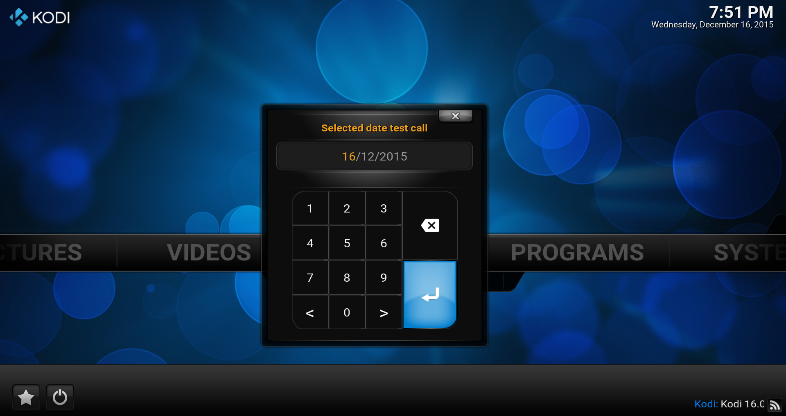

# *<p align="center">Kodi development</p>*
-------------
*<p align="center">
  [](http://kodi.tv/)
  [](http://kodi.tv/)
</p>*
*<p align="center">
  [](../Readme.md#CAddonGUIDialogNumeric)
</p>*
#### *<p align="center">Binary add-on GUI library, Version Level: 2</p>*
## *<p align="center">Numeric dialog</p>*
-------------

The functions listed below have to be permitted by the user for the representation of a numeric keyboard around an input.

The class supports several kinds, from an easy number choice up to the passport Word production and their confirmation for add-on.

It has the header `#include <kodi/gui.api2/GUIDialogNumeric.h>` be included to enjoy it.

Functions
-------------

1. [bool ShowAndVerifyNewPassword(std::string& strNewPassword);](#CAddonGUIDialogNumeric_ShowAndVerifyNewPassword)
* [int ShowAndVerifyPassword(std::string& strPassword, const std::string& strHeading, int iRetries);](#CAddonGUIDialogNumeric_ShowAndVerifyPassword)
* [bool ShowAndVerifyInput(std::string& strPassword, const std::string& strHeading, bool bGetUserInput);](#CAddonGUIDialogNumeric_ShowAndVerifyInput)
* [bool ShowAndGetTime(tm& time, const std::string& strHeading);](#CAddonGUIDialogNumeric_ShowAndGetTime)
* [bool ShowAndGetDate(tm& date, const std::string& strHeading);](#CAddonGUIDialogNumeric_ShowAndGetDate)
* [bool ShowAndGetIPAddress(std::string& strIPAddress, const std::string& strHeading);](#CAddonGUIDialogNumeric_ShowAndGetIPAddress)
* [bool ShowAndGetNumber(std::string& strInput, const std::string& strHeading, unsigned int iAutoCloseTimeoutMs);](#CAddonGUIDialogNumeric_ShowAndGetNumber)
* [bool ShowAndGetSeconds(std::string& strTime, const std::string& strHeading);](#CAddonGUIDialogNumeric_ShowAndGetSeconds)

-------------

*<p align="center"></p>*

-------------

*  <a id="CAddonGUIDialogNumeric_ShowAndVerifyNewPassword"></a>
**`bool CAddonGUIDialogNumeric::ShowAndVerifyNewPassword(std::string& strNewPassword);`**
    * Use dialog to get numeric new password
      * **`strNewPassword`**:  String to preload into the keyboard accumulator. Overwritten with user input if
        **return=true**.
      * **return:**
        * `true`   - if successful display and user input entry/re-entry.
        * `false`  - if unsuccessful display, no user input, or canceled editing.

*  <a id="CAddonGUIDialogNumeric_ShowAndVerifyPassword"></a>
**`int CAddonGUIDialogNumeric::ShowAndVerifyPassword(std::string& strPassword, const std::string& strHeading, int iRetries);`**
    * Use dialog to verify numeric password
      * **`strPassword`:** 	Overwritten with user input if return=true.
      * **`strHeading`:**   Heading to display
      * **`iRetries`:**     If greater than 0, shows "Incorrect password, %d retries left" on dialog line 2, else 
        line 2 is blank.
      * **return:**
        * `true`   - if successful display and user input entry/re-entry.
        * `false`  - if unsuccessful display, no user input, or canceled editing.

    Example:
    ```cpp
      #include <stdio.h>      /* fprintf */
      #include "kodi/addon.api2/General.h"
      #include <kodi/gui.api2/GUIDialogNumeric.h>

      /*
       * The example below shows the complete use of keyboard dialog for password
       * check. If only one check from add-on needed can be function with retries
       * set to '0' called alone.
       *
       * The use of MD5 translated password is always required for the check on Kodi!
       */

      /*
       * Get from Kodi's global settings the maximum allowed retries for passwords.
       */
      int maxretries = 0;
      if (CAddOnLib_General::GetSettingInt("masterlock.maxretries", maxretries, true))
      {
        /*
         * Password names need to be send as md5 sum to kodi.
         */
        std::string password;
        CAddOnLib_General::GetMD5("1234", password);

        /*
         * To the loop about password checks.
         */
        int ret;
        for (unsigned int i = 0; i < maxretries; i++)
        {
          /*
           * Ask the user about the password.
           */
          ret = CAddonGUIDialogNumeric::ShowAndVerifyPassword(password, "Demo numeric password call for PW '1234'", i);
          if (ret == 0)
          {
            fprintf(stderr, "Numeric password successfull confirmed after '%i' tries\n", i+1);
            break;
          }
          else if (ret < 0)
          {
            fprintf(stderr, "Canceled editing on try '%i'\n", i+1);
            break;
          }
          else /* if (ret > 0) */
          {
            fprintf(stderr, "Wrong numeric password entered on try '%i'\n", i+1);
          }
        }
      }
      else
        fprintf(stderr, "Requested global setting value 'masterlock.maxretries' not present!");
    ```

*  <a id="CAddonGUIDialogNumeric_ShowAndVerifyInput"></a>
**`bool CAddonGUIDialogNumeric::ShowAndVerifyInput(std::string& strPassword, const std::string& strHeading, bool bGetUserInput);`**
    * Use dialog to verify numeric password
      * **`strToVerify`:** 	Overwritten with user input if return=true.
      * **`strHeading`:**  	Heading to display
      * **`bVerifyInput`:** If set as true we verify the users input versus strToVerify.
      * **return:**
        * `true`   - if successful display and user input entry/re-entry.
        * `false`  - if unsuccessful display, no user input, or canceled editing.

*  <a id="CAddonGUIDialogNumeric_ShowAndGetTime"></a>
**`bool CAddonGUIDialogNumeric::ShowAndGetTime(tm& time, const std::string& strHeading);`**
    * Use dialog to get time value
      * **`time`:**:        Overwritten with user input if return=true and time inserted.
      * **`strHeading`:**   Heading to display
      * **return:**
        * `true`   - if successful display and user input entry/re-entry.
        * `false`  - if unsuccessful display, no user input, or canceled editing.

    Example:
    ```Cpp
      #include <stdio.h>      /* printf */
      #include <time.h>       /* time_t, struct tm, time, localtime, strftime */
      #include <kodi/gui.api2/GUIDialogNumeric.h>

      time_t rawtime;
      struct tm * timeinfo;
      char buffer [10];

      time (&rawtime);
      timeinfo = localtime(&rawtime);
      bool bRet = CAddonGUIDialogNumeric::ShowAndGetTime(*timeinfo, "Selected time test call");
      strftime(buffer, sizeof(buffer), "%H:%M.", timeinfo);
      printf("Selected time it's %s and was on Dialog %s\n", buffer, bRet ? "OK" : "Canceled");
    ```

*  <a id="CAddonGUIDialogNumeric_ShowAndGetDate"></a>
**`bool CAddonGUIDialogNumeric::ShowAndGetDate(tm& date, const std::string& strHeading);`**
    * Use dialog to get date value
      * **`date`:**         Overwritten with user input if return=true and date inserted.
      * **`strHeading`:**   Heading to display
        * `true`   - if successful display and user input entry/re-entry.
        * `false`  - if unsuccessful display, no user input, or canceled editing.

    Example:
    ```Cpp
      #include <stdio.h>      /* printf */
      #include <time.h>       /* time_t, struct tm, time, localtime, strftime */
      #include <kodi/gui.api2/GUIDialogNumeric.h>

      time_t rawtime;
      struct tm * timeinfo;
      char buffer [20];

      time (&rawtime);
      timeinfo = localtime(&rawtime);
      bool bRet = CAddonGUIDialogNumeric::ShowAndGetDate(*timeinfo, "Selected date test call");
      strftime(buffer, sizeof(buffer), "%Y-%m-%d", timeinfo);
      printf("Selected date it's %s and was on Dialog %s\n", buffer, bRet ? "OK" : "Canceled");
    ```

*  <a id="CAddonGUIDialogNumeric_ShowAndGetIPAddress"></a>
**`bool CAddonGUIDialogNumeric::ShowAndGetIPAddress(std::string& strIPAddress, const std::string& strHeading);`**
    * Use dialog to get a IP
      * **`strIPAddress`;**        Overwritten with user input if return=true and IP address inserted.
      * **`strHeading`:**          Heading to display
      * **return:**
        * `true`   - if successful display and user input entry/re-entry.
        * `false`  - if unsuccessful display, no user input, or canceled editing.

*  <a id="CAddonGUIDialogNumeric_ShowAndGetNumber"></a>
**`bool CAddonGUIDialogNumeric::ShowAndGetNumber(std::string& strInput, const std::string& strHeading, unsigned int iAutoCloseTimeoutMs = 0);`**
    * Use dialog to get normal number
      * **`strInput`:**             Overwritten with user input if return=true and time in seconds inserted.
      * **`strHeading`:**           Heading to display
      * **`iAutoCloseTimeoutMs`:**  To close the dialog after a specified time, in milliseconds, default is 0 which
        keeps the dialog open indefinitely.
      * **return:**
        * `true`   - if successful display and user input entry/re-entry.
        * `false`  - if unsuccessful display, no user input, or canceled editing.

    Example:
    ```Cpp
      #include <stdio.h>      /* printf */
      #include <stdlib.h>     /* strtoull (C++11) */
      #include <kodi/gui.api2/GUIDialogNumeric.h>

      std::string number;
      bool bRet = CAddonGUIDialogNumeric::ShowAndGetNumber(number, "Number test call");
      printf("Written number input is : %llu and was %s\n", 
                     strtoull(number.c_str(), nullptr, 0), bRet ? "OK" : "Canceled");
    ```

*  <a id="CAddonGUIDialogNumeric_ShowAndGetSeconds"></a>
**`bool CAddonGUIDialogNumeric::ShowAndGetSeconds(std::string& strTime, const std::string& strHeading);`**
    * Use dialog to get seconds value
      * **`strTime`:**             Overwritten with user input if return=true and time in seconds inserted.
      * **`strHeading`:**          Heading to display
      * **return:**
        * `true`   - if successful display and user input entry/re-entry.
        * `false`  - if unsuccessful display, no user input, or canceled editing.
