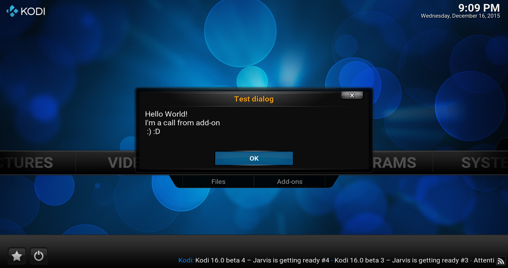

# *<p align="center">Kodi development</p>*
-------------
*<p align="center">
  [](http://kodi.tv/)
  [](http://kodi.tv/)
</p>*
*<p align="center">
  [](../Readme.md#CAddonGUIDialogOK)
</p>*
#### *<p align="center">Binary add-on GUI library, Version Level: 2</p>*
## *<p align="center">OK dialog</p>*
-------------

General
-------------

The functions listed below permit the call of a dialogue of information, a confirmation of the user by press from OK required.

It has the header [`#include <kodi/gui.api2/GUIDialogOK.h>`](../GUIDialogOK.h) be included to enjoy it.

Functions
-------------

1. [void ShowAndGetInput(const std::string& heading, const std::string& text);](#CAddonGUIDialogOK_ShowAndGetInput_1)
* [void ShowAndGetInput(const std::string& heading, const std::string& line0, const std::string& line1, const std::string& line2);](#CAddonGUIDialogOK_ShowAndGetInput_2)

-------------

*<p align="center"></p>*

-------------

*  <a id="CAddonGUIDialogOK_ShowAndGetInput_1"></a>
**`void CAddonGUIDialogOK::ShowAndGetInput(const std::string& heading, const std::string& text);`**
    * Use dialog to inform user with text and confirmation with OK with continued string.
      * **`heading`:** Dialog heading.
      * **`text`:** Multi-line text.

    Code example:
    ```cpp
    #include <kodi/gui.api2/GUIDialogOK.h>

    CAddonGUIDialogOK::ShowAndGetInput("Test dialog", "Hello World!\nI'm a call from add-on\n :) :D");
    ```

*  <a id="CAddonGUIDialogOK_ShowAndGetInput_2"></a>
**`void CAddonGUIDialogOK::ShowAndGetInput(const std::string& heading, const std::string& line0, const std::string& line1, const std::string& line2);`**
    * Use dialog to inform user with text and confirmation with OK with strings separated to the lines.
      * **`heading`:** Dialog heading.
      * **`line0`:** Line #1 text.
      * **`line1`:** Line #2 text.
      * **`line2`:** Line #3 text.

    Code example:
    ```cpp
    #include <kodi/gui.api2/GUIDialogOK.h>

    CAddonGUIDialogOK::ShowAndGetInput("Test dialog", "Hello World!", "I'm a call from add-on", " :) :D");
    ```
