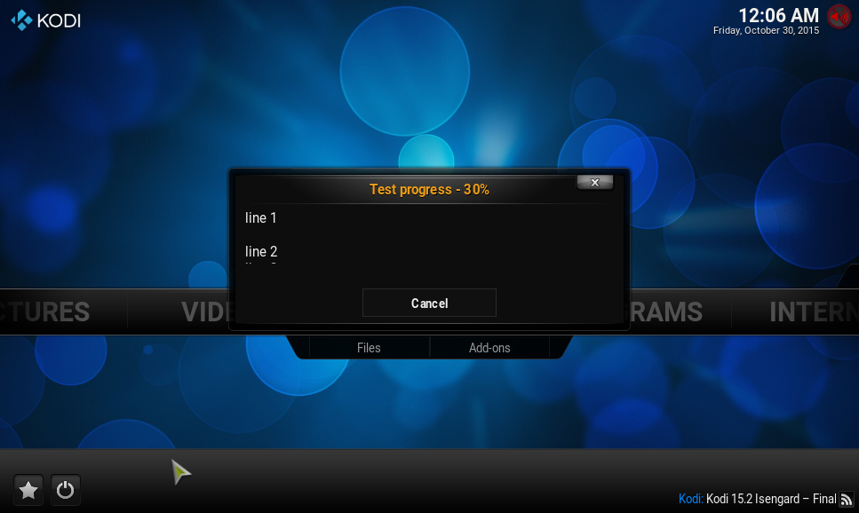

# *<p align="center">Kodi development</p>*
-------------
*<p align="center">
  [](http://kodi.tv/)
  [](http://kodi.tv/)
</p>*
*<p align="center">
  [](../Readme.md#CAddonGUIDialogProgress)
</p>*
#### *<p align="center">GUI dialog</p>*
-------------

The with `#include <kodi/addon.api2/GUIDialogProgress.h>` given class are basically used to create Kodi's progress dialog 
with named text fields.

##### Progress dialog shown in center

Code example:
```cpp
#include <kodi/addon.api2/GUIDialogProgress.h>

CAddonGUIDialogProgress *progress = new CAddonGUIDialogProgress;
progress->SetHeading("Test progress");
progress->SetLine(1, "line 1");
progress->SetLine(2, "line 2");
progress->SetLine(3, "line 3");
progress->SetCanCancel(true);
progress->ShowProgressBar(true);
progress->Open();
for (unsigned int i = 0; i < 100; i += 10)
{
  progress->SetPercentage(i);
  sleep(1);
}
delete progress;
```

-------------

*<p align="center"></p>*

Classes
-------------

#### Class: `CAddonGUIDialogProgress::CAddonGUIDialogProgress();`

It use the **DialogProgress.xml** skin file from Kodi.

*  **`CAddonGUIDialogProgress();`**
    * Construct a new dialog

*  **`~CAddonGUIDialogProgress();`**
    * Destructor

*  **`void Open();`**
    * To open the dialog

*  **`void SetHeading(const std::string& heading);`**
    * Set the heading title of dialog
      * **`heading`:** Title string to use

*  **`void SetLine(unsigned int iLine, const std::string& line);`**
    * To set the line text field on dialog from 0 - 2
      * **`iLine`:** Line number
      * **`line`:** Text string

*  **`void SetCanCancel(bool bCanCancel);`**
    * To enable and show cancel button on dialog
      * **`bCanCancel`:** if true becomes it shown

*  **`bool IsCanceled() const;`**
    * To check dialog for clicked cancel button
      * **Return:** True if canceled

*  **`float Percentage() const;`**
    * Get the current progress position as percent
      * **Return:** Position

*  **`void SetPercentage(float fPercentage);`**
    * To set the current progress position as percent
      * **`fPercentage`:** Position to use from 0.0 to 100.0

*  **`void ShowProgressBar(bool bOnOff);`**
    * To show or hide progress bar dialog
      * **`bOnOff`:** If true becomes it shown

*  **`etProgressMax(int iMax);`**
    * Set the maximum position of progress, needed if `SetProgressAdvance(...)` is used
      * **`iMax`:** Biggest usable position to use

*  **`void SetProgressAdvance(int nSteps=1);`**
    * To increase progress bar by defined step size until reach of maximum position
      * **`nSteps`:** Step size to increase, default is 1

*  **`bool Abort();`**
    * To check progress was canceled on work
      * **Return:** True if aborted
