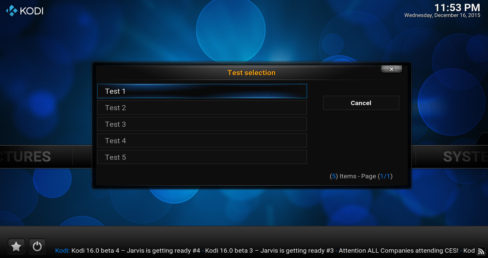

# *<p align="center">Kodi development</p>*
-------------
*<p align="center">
  [](http://kodi.tv/)
  [](http://kodi.tv/)
</p>*
*<p align="center">
  [](../Readme.md#CAddonGUIDialogSelect)
</p>*
#### *<p align="center">Binary add-on GUI library, Version Level: 2</p>*
## *<p align="center">Selection dialog</p>*
-------------

General
-------------

The function listed below permits the call of a dialogue to select of an entry as a key.

It has the header `#include <kodi/gui.api2/AddonGUIDialogSelect.h>` be included to enjoy it.

Functions
-------------

1. [int Show(const std::string& heading, const std::vector< std::string >& entries, unsigned int size, int selected);](#CAddonGUIDialogSelect_Show)

-------------

*<p align="center"></p>*

-------------

*  <a id="CAddonGUIDialogSelect_Show"></a>
**`int CAddonGUIDialogSelect::Show(const std::string& heading, const std::vector<std::string>& entries, int selected = -1);`**
    * Show a selection dialog about given parts.
      * **`heading`:** Dialog heading name.
      * **`entries`:** String list about entries.
      * **`selected`:** Predefined selection (default is `-1` for the first).
      * **return:** The selected entry, if return `-1` was nothing selected or canceled.

    Code example:
    ```cpp
      const std::vector<std::string> entries
      {
        "Test 1",
        "Test 2",
        "Test 3",
        "Test 4",
        "Test 5"
      };

      int selected = CAddonGUIDialogSelect::Show("Test selection", entries, -1);
      if (selected < 0)
        fprintf(stderr, "Item selection canceled\n");
      else
        fprintf(stderr, "Selected item is: %i\n", selected);
    ```