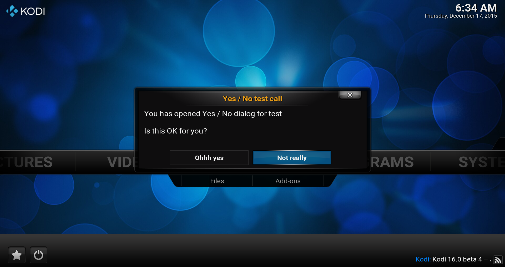

# *<p align="center">Kodi development</p>*
-------------
*<p align="center">
  [](http://kodi.tv/)
  [](http://kodi.tv/)
</p>*
*<p align="center">
  [](../Readme.md#CAddonGUIDialogYesNo)
</p>*
#### *<p align="center">Binary add-on GUI library, Version Level: 2</p>*
## *<p align="center">Yes / No dialog</p>*
-------------

General
-------------

The Yes / No dialog can be used to inform the user about questions and get the answer.

In order to achieve a line break is a `\n` directly in the text or in the **"./resources/language/resource.language.??_??/strings.po"** to call with
[`std::string CAddOnLib_General::GetLocalizedString(...);`](../../addon.api2/docs/General.md#CAddOnLib_General_GetLocalizedString).

It has the header [`#include <kodi/gui.api2/GUIDialogYesNo.h>`](../GUIDialogYesNo.h) be included to enjoy it.

Functions
-------------

1. [bool ShowAndGetInput(const std::string& heading, const std::string& text, bool& bCanceled, const std::string& noLabel, const std::string& yesLabel);](#CAddonGUIDialogYesNo_ShowAndGetInput_1)
* [bool ShowAndGetInput(const std::string& heading, const std::string& line0, const std::string& line1, const std::string& line2, const std::string& noLabel, const std::string& yesLabel);](#CAddonGUIDialogYesNo_ShowAndGetInput_2)
* [bool ShowAndGetInput(const std::string& heading, const std::string& line0, const std::string& line1, const std::string& line2, bool& bCanceled, const std::string& noLabel, const std::string& yesLabel);](#CAddonGUIDialogYesNo_ShowAndGetInput_3)

-------------

*<p align="center"></p>*

-------------

*  <a id="CAddonGUIDialogYesNo_ShowAndGetInput_1"></a>
**`bool CAddonGUIDialogYesNo::ShowAndGetInput(const std::string& heading, const std::string& text, bool& bCanceled, const std::string& noLabel = "", const std::string& yesLabel = "");`**
    * Use dialog to get numeric new password with one text string shown everywhere and cancel return field
      * **`heading`:** Dialog heading.
      * **`text`:** Multi-line text.
      * **`bCanceled`:** Return value about cancel button
      * **`noLabel`:** [opt] label to put on the no button.
      * **`yesLabel`:** [opt] label to put on the yes button.
      * **return:** Returns True if 'Yes' was pressed, else False.
      * ***Note:*** It is preferred to only use this as it is actually a multi-line text.

    Code example:
    ```cpp
      #include <kodi/gui.api2/GUIDialogYesNo.h>

      bool canceled;
      bool ret = CAddonGUIDialogYesNo::ShowAndGetInput(
          "Yes / No test call",   // The Header
          "You has opened Yes / No dialog for test\n\nIs this OK for you?",
          canceled,               // return value about cancel button
          "Not really",           // No label, is optional and if empty "No"
          "Ohhh yes");            // Yes label, also optional and if empty "Yes"
      fprintf(stderr, "You has called Yes/No, returned '%s' and was %s\n",
                ret ? "yes" : "no",
                canceled ? "canceled" : "not canceled");
    ```

*  <a id="CAddonGUIDialogYesNo_ShowAndGetInput_2"></a>
**`bool CAddonGUIDialogYesNo::ShowAndGetInput(const std::string& heading, const std::string& line0, const std::string& line1, const std::string& line2, const std::string& noLabel = "", const std::string& yesLabel = "");`**
    * Use dialog to get numeric new password with separated line strings
      * **`heading`:** Dialog heading.
      * **`line0`:** Line #0 text.
      * **`line1`:** Line #1 text.
      * **`line2`:** Line #2 text.
      * **`noLabel`:** [opt] label to put on the no button.
      * **`yesLabel`:** [opt] label to put on the yes button.
      * **return:** Returns True if 'Yes' was pressed, else False.

*  <a id="CAddonGUIDialogYesNo_ShowAndGetInput_3"></a>
**`bool CAddonGUIDialogYesNo::ShowAndGetInput(const std::string& heading, const std::string& line0, const std::string& line1, const std::string& line2, bool& bCanceled, const std::string& noLabel = "", const std::string& yesLabel = "");`**
    * Use dialog to get numeric new password with separated line strings and cancel return field
      * **`heading`:** Dialog heading.
      * **`line0`:** Line #0 text.
      * **`line1`:** Line #1 text.
      * **`line2`:** Line #2 text.
      * **`bCanceled`:** Return value about cancel button
      * **`noLabel`:** [opt] label to put on the no button.
      * **`yesLabel`:** [opt] label to put on the yes button.
      * **return:** Returns True if 'Yes' was pressed, else False.
